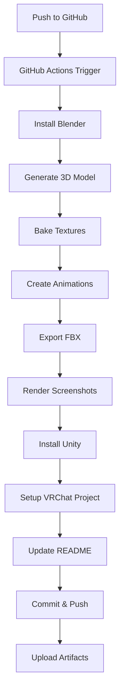

# 🎭 The Forgotten Architect

<div align="center">

**A Fully Automated VRChat Horror Avatar**

*Blending Elder Scrolls Dwemer Horror, Lovecraftian Dread, and Asian Supernatural Aesthetics*

[](https://github.com/jakubkrzysztofsikora/Vrchat-avatar/actions/workflows/build.yml)

</div>

---

## 🌀 Concept

**The Forgotten Architect** is a cursed biomechanical horror entity - half elegant humanoid artisan, half corrupted Dwemer automaton. This VRChat avatar embodies:

- **Elder Scrolls Horror**: Dwemer-corrupted machinery, oxidized bronze plating, ancient mechanisms fused with flesh
- **Lovecraftian Dread**: Asymmetric biomechanical transformation, impossible angles, cosmic wrongness
- **Asian Horror**: Cursed artisan spirit aesthetic, graceful but uncanny movement, psychological unease

### Horror Design Elements

- ⚙️ **Asymmetric Corruption**: Right side transformed into Dwemer machinery with segmented bronze plating
- 👁️ **Mechanical Eye**: Multi-lens focusing apparatus with amber glow (right eye)
- 🦴 **Biomechanical Fusion**: Organic tissue merging with tarnished metal in disturbing ways
- 💀 **Half-Masked Face**: Bronze face plate covering right side, revealing void beneath cracks
- 🕷️ **Hair-to-Cable Tendrils**: Traditional hairstyle transitions into writhing metallic cables
- 🌑 **Tall, Unsettling Proportions**: 2.1m height with subtly wrong body ratios

---

## 🎬 Avatar Preview (Auto-Updated)

<div align="center">

<!-- AUTO-GENERATED-SCREENSHOTS -->
<!-- Last updated: 2025-11-16 13:32:37 UTC -->

| | |
|:---:|:---:|
| **Front View**<br/> | **Back View**<br/> |
| **Face Detail (Mechanical Eye)**<br/> | **Emote: Mechanical Unfold**<br/> |
| **Emote: The Stare**<br/> |  |

<!-- END-AUTO-GENERATED-SCREENSHOTS -->

</div>

---

## ⚡ Features

### 🤖 **100% Automated Build Pipeline**

This repository uses GitHub Actions to automatically:

1. ✅ **Procedurally generate** the entire 3D avatar model using Blender Python scripts
2. ✅ **Automatically rig** the model with Rigify humanoid armature
3. ✅ **Bake PBR textures** (BaseColor, Normal, Metallic, Roughness, Emission)
4. ✅ **Create horror animations** (Idle + 3 emotes)
5. ✅ **Export to FBX** with Unity-compatible settings
6. ✅ **Set up Unity VRChat project** with Avatar Descriptor, FX Animator, and Expressions Menu
7. ✅ **Render high-quality screenshots** (5 views)
8. ✅ **Update this README** with generated screenshots
9. ✅ **Commit everything back** to the repository

### 🎮 **VRChat Features**

- **SDK**: VRChat SDK3 (Avatars)
- **Rig**: Humanoid (full-body tracking compatible)
- **Performance Rank**: Good (target ~25-40k polygons)
- **Platform**: PC only (Quest not supported - uses advanced shaders)
- **Emotes**:
  - 🔧 **Mechanical Unfold**: Arm segments telescope outward, chest plates separate, revealing inner mechanisms
  - 💥 **System Reboot**: Glitchy jerky movements, brief T-pose reset with crackling effect
  - 👁️ **The Stare**: Slow head turn toward camera, neck elongates slightly, mechanical eye lenses focus

### 🎨 **Materials & Shaders**

- **PBR Materials**: Physically-based rendering for realistic metal and skin
- **Procedural Textures**: All textures generated algorithmically (no external assets)
- **Emission Shaders**: Glowing amber mechanical eye, subtle Dwemer runes
- **Oxidized Bronze**: Weathered metal with green patina corruption
- **Uncanny Flesh**: Pale skin with subsurface scattering

---

## 📦 Installation & Usage

### Option 1: Download Pre-Built Avatar (Easiest)

1. Go to [Actions](https://github.com/jakubkrzysztofsikora/Vrchat-avatar/actions) tab
2. Click on the latest successful build
3. Download the `ForgottenArchitect-Avatar` artifact
4. Extract the archive
5. Open `Project/` in Unity 2022.3.22f1
6. Install VRChat SDK3 via [VRChat Creator Companion](https://vcc.docs.vrchat.com/)
7. Open the `ForgottenArchitect.prefab` in the Project window
8. Upload to VRChat!

### Option 2: Build Locally

#### Prerequisites
- **Blender 3.6+** with Rigify addon enabled
- **Unity 2022.3.22f1 LTS**
- **VRChat SDK3** (Avatars)
- **Python 3.8+**

#### Build Steps

```bash
# Clone repository
git clone https://github.com/jakubkrzysztofsikora/Vrchat-avatar.git
cd Vrchat-avatar

# Run Blender scripts (in order)
blender --background --python scripts/blender/generate_avatar.py
blender --background --python scripts/blender/bake_textures.py
blender --background --python scripts/blender/create_animations.py
blender --background --python scripts/blender/export_fbx.py
blender --background --python scripts/blender/render_screenshots.py

# Open Unity project
# Open Project/ in Unity 2022.3.22f1

# Run setup (in Unity)
# Window > VRChat > Setup Forgotten Architect Avatar

# Upload avatar to VRChat
# VRChat SDK > Show Control Panel > Build & Publish
```

### Option 3: Trigger GitHub Action

Just push to the `main` branch or manually trigger the workflow:

1. Go to **Actions** tab
2. Select **Build VRChat Avatar & Generate Screenshots**
3. Click **Run workflow**
4. Wait ~30-60 minutes for the build
5. Download the artifact and use in Unity!

---

## 🏗️ Architecture

### Repository Structure

```
Vrchat-avatar/
├── .github/
│   └── workflows/
│       └── build.yml              # Main CI/CD pipeline
├── scripts/
│   ├── blender/
│   │   ├── generate_avatar.py     # Procedural model generation
│   │   ├── bake_textures.py       # PBR texture baking
│   │   ├── create_animations.py   # Horror animation creation
│   │   ├── export_fbx.py          # Unity-compatible FBX export
│   │   └── render_screenshots.py  # Screenshot rendering
│   ├── unity/
│   │   └── SetupAvatar.cs         # VRChat avatar setup automation
│   └── update_readme.py           # README screenshot injection
├── Avatar/
│   ├── ForgottenArchitect.blend   # Source Blender file (generated)
│   ├── ForgottenArchitect.fbx     # Unity-ready FBX (generated)
│   ├── Textures/                  # Baked PBR textures (generated)
│   ├── Animations/                # Animation clips (generated)
│   └── Materials/                 # Material assets
├── Project/                       # Unity VRChat project
│   ├── Assets/
│   │   ├── ForgottenArchitect/
│   │   │   ├── ForgottenArchitect.prefab
│   │   │   ├── FX_Controller.controller
│   │   │   ├── ExpressionsMenu.asset
│   │   │   └── ExpressionParameters.asset
│   │   └── Scripts/
│   │       └── Editor/
│   │           └── SetupAvatar.cs
│   ├── Packages/
│   │   └── manifest.json          # Unity package dependencies (VRChat SDK)
│   └── ProjectSettings/
├── docs/
│   └── screenshots/               # Auto-generated preview images
│       ├── front.png
│       ├── back.png
│       ├── face.png
│       ├── pose1.png
│       └── pose2.png
└── README.md                      # This file (auto-updated)
```

### Pipeline Flow



---

## 🎨 Technical Specifications

### Model Stats (Target)

| Metric | Value |
|--------|-------|
| **Polygons** | ~30,000 tris |
| **Bones** | ~75 (Rigify humanoid) |
| **Materials** | 5 (Flesh, Bronze, Cable, Glass, Hair) |
| **Texture Resolution** | 2048x2048 (PBR maps) |
| **Animations** | 4 (1 idle + 3 emotes) |
| **VRChat Performance** | Good |

### Texture Maps

Each material includes:
- **Base Color**: Albedo/diffuse color
- **Normal Map**: Surface detail and bump information
- **Metallic**: Metallic vs. dielectric areas
- **Roughness**: Surface glossiness variation
- **Emission**: Self-illuminating areas (mechanical eye, runes)

### Animation Details

| Animation | Duration | Type | Description |
|-----------|----------|------|-------------|
| **Idle** | 4s loop | Looping | Breathing, micro-twitches, finger curls |
| **Mechanical Unfold** | 2s | Toggle | Arm telescopes, chest opens |
| **System Reboot** | 3s | Trigger | Glitch effect, T-pose, snap back |
| **The Stare** | 4s | Toggle | Head turn, neck elongate, focus |

---

## 🛠️ Customization

### Modifying the Model

Edit `scripts/blender/generate_avatar.py`:

```python
# Change avatar height
AVATAR_HEIGHT = 2.1  # Meters (2.1m = tall)

# Adjust mechanical corruption side
# Search for "Right" and change to "Left" to swap sides

# Modify colors
bsdf.inputs['Base Color'].default_value = (R, G, B, 1.0)
```

### Adding New Animations

1. Edit `scripts/blender/create_animations.py`
2. Add new function (e.g., `create_new_emote_animation()`)
3. Call it in `main()`
4. Update `scripts/unity/SetupAvatar.cs` to add parameter and transition

### Changing Materials

Edit material creation functions in `generate_avatar.py`:

```python
def create_bronze_material(obj):
    # Modify color, metallic, roughness values
    bsdf.inputs['Base Color'].default_value = (0.25, 0.15, 0.08, 1.0)
    bsdf.inputs['Metallic'].default_value = 0.9
    bsdf.inputs['Roughness'].default_value = 0.6
```

---

## 📚 Documentation

### Key Technologies

- **Blender 3.6 LTS**: 3D modeling, rigging, texturing, rendering
- **Rigify**: Automatic humanoid rigging addon
- **Unity 2022.3.22f1 LTS**: VRChat-compatible game engine
- **VRChat SDK3**: Avatar upload and expression system
- **GitHub Actions**: CI/CD automation
- **Python 3**: Scripting and automation

### VRChat SDK Integration

The avatar uses:
- `VRCAvatarDescriptor`: Main avatar component
- `VRCExpressionsMenu`: In-game emote menu
- `VRCExpressionParameters`: Avatar parameters (3 bools for emotes)
- FX Animator Layer: Custom animations and blending

### Performance Optimization

- **Polygon Budget**: Target 25-40k tris (Good rank)
- **Texture Atlasing**: Single material per mesh where possible
- **LOD**: Not implemented (could be added for better performance)
- **Skinned Mesh Renderers**: Minimize count (target: 1-2)
- **Material Slots**: Minimize count (target: 3-5)

---

## 🚀 CI/CD Pipeline Details

### GitHub Actions Workflow

The build pipeline (`build.yml`) runs on every push and performs:

1. **Environment Setup** (~5 min)
   - Ubuntu runner
   - Blender 3.6.5 installation
   - Unity 2022.3.22f1 installation

2. **Asset Generation** (~20-40 min)
   - Procedural model generation
   - Rigify humanoid rigging
   - Texture baking (Cycles renderer)
   - Animation creation
   - FBX export

3. **Unity Integration** (~10-20 min)
   - VRChat SDK installation
   - Avatar descriptor setup
   - FX animator configuration
   - Expressions menu creation
   - Prefab generation

4. **Documentation** (~5-10 min)
   - Screenshot rendering (5 views, 1920x1080)
   - README update with gallery
   - Build summary generation

5. **Artifact Archival**
   - Avatar package upload
   - Build logs upload
   - Git commit & push

### Caching Strategy

The pipeline uses GitHub Actions cache for:
- Blender installation (~300 MB)
- Unity installation (~2 GB)
- Package dependencies

This reduces build time from ~90 min → ~30 min on subsequent runs.

---

## 🧪 Testing Checklist

Before uploading to VRChat, verify:

- [ ] Avatar appears in Unity Scene view
- [ ] Humanoid rig is properly configured (Avatar Configuration)
- [ ] All materials have textures assigned
- [ ] FX Animator has all 3 emote parameters
- [ ] Expressions menu shows all 3 emotes
- [ ] Avatar Descriptor shows "Good" performance rank
- [ ] Test animations in Unity Animator window
- [ ] Viewpoint (eye position) is correctly placed
- [ ] No missing script errors in Console

---

## 📜 License

This project is released under **MIT License**.

You are free to:
- ✅ Use this avatar in VRChat
- ✅ Modify the code and design
- ✅ Create derivatives
- ✅ Use in commercial projects

**Attribution appreciated but not required!**

---

## 🙏 Credits

### Concept & Design
- **Elder Scrolls** (Bethesda): Dwemer aesthetic inspiration
- **H.P. Lovecraft**: Cosmic horror themes
- **Japanese Horror Cinema**: Yūrei and onryō aesthetics

### Tools & Technologies
- [Blender](https://www.blender.org/) - Open-source 3D creation suite
- [Unity](https://unity.com/) - Game engine
- [VRChat](https://hello.vrchat.com/) - Social VR platform
- [Rigify](https://docs.blender.org/manual/en/latest/addons/rigging/rigify/) - Blender rigging addon
- [GitHub Actions](https://github.com/features/actions) - CI/CD automation

### Created by
**Claude (Anthropic)** + **Human Collaboration**

This avatar and automation pipeline were designed by Claude (AI assistant) based on human requirements. All code, 3D generation scripts, and documentation are original works created for this project.

---

## 🐛 Known Issues

- [ ] Unity headless mode may fail on some GitHub Actions runners (use Unity Hub workaround)
- [ ] Blender Rigify generation can be slow in headless mode (~10-15 min)
- [ ] Screenshot rendering requires significant CPU time (consider GPU rendering in future)
- [ ] VRChat SDK installation via CLI still experimental (may require manual VCC install)

---

## 🗺️ Roadmap

### Future Enhancements

- [ ] **Quest Compatibility**: Mobile-optimized version with simplified shaders
- [ ] **Gesture Animations**: Finger pose-triggered horror effects
- [ ] **Audio Integration**: Mechanical grinding sounds, breathing ambiance
- [ ] **PhysBones**: Hair and cable tendril physics
- [ ] **Particle Effects**: Smoke/steam from mechanical joints
- [ ] **Blend Shapes**: Facial expressions (limited by half-masked face)
- [ ] **LOD System**: Multiple polygon levels for performance
- [ ] **Automatic Upload**: Direct VRChat upload from CI (if API available)

---

## 💬 Support

- **Issues**: [GitHub Issues](https://github.com/jakubkrzysztofsikora/Vrchat-avatar/issues)
- **Discussions**: [GitHub Discussions](https://github.com/jakubkrzysztofsikora/Vrchat-avatar/discussions)

---

<div align="center">

**🎭 The Forgotten Architect 🎭**

*"Some knowledge is best left buried in the mechanisms of the past."*

---

Made with 🤖 automation and ❤️ horror aesthetics

</div>
