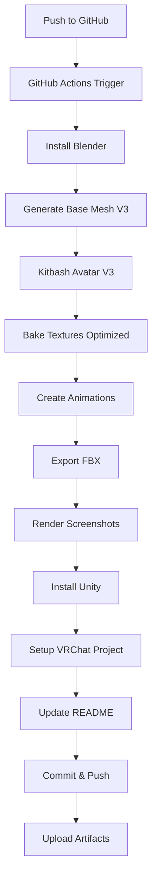

# 🎭 The Penitent Mechanism

<div align="center">

**A Fully Automated VRChat Horror Avatar**

*Buddhist Shrine Guardian Possessed by Dwemer Machinery*

[](https://github.com/jakubkrzysztofsikora/Vrchat-avatar/actions/workflows/build.yml)

</div>

---

## 🌀 Concept

**The Penitent Mechanism** is an ancient Buddhist/Shinto shrine guardian statue possessed and corrupted by Dwemer machinery. This VRChat avatar embodies:

- **Elder Scrolls Horror**: Dwemer machinery animating sacred statuary, oxidized bronze construction, ancient mechanisms corrupting holy relics
- **Asian Horror Minimalism**: Shrine guardian aesthetic, kneeling penitent pose, featureless bronze mask, uncanny stillness punctuated by mechanical movement
- **Lovecraftian Wrongness**: Body segmentation defying anatomy, telescoping limbs, impossible prayer pose with fused blade-hands

### Horror Design Elements

- 🙏 **Eternal Penitent**: Locked in kneeling prayer pose (1.8m kneeling, 2.4m if standing)
- 🎭 **Bronze Mask Face**: Smooth featureless mask with almond eye cutouts - NO nose, NO mouth, NO expression
- 🗡️ **Fused Blade-Hands**: Fingers merged into single sharp points - cannot grasp, only pray and pierce
- 🦴 **Segmented Neck**: Multiple bronze rings allowing unnatural craning and rotation
- 🦿 **Telescoping Legs**: Can extend from kneeling to standing in disturbing mechanical sequence
- ☸️ **Mechanical Halo**: Rotating bronze rings behind head with Dwemer inscriptions and amber light
- 🎨 **Aged Bronze Aesthetic**: Dark oxidized bronze with green verdigris corruption, ivory joints, saffron prayer cloth

---

## 🎬 Avatar Preview (Auto-Updated)

<div align="center">

<!-- AUTO-GENERATED-SCREENSHOTS -->
<!-- Last updated: 2025-11-17 09:22:16 UTC -->

| | |
|:---:|:---:|
| **Front View**<br/> | **Back View**<br/> |
| **Face Detail (Mechanical Eye)**<br/> | **Emote: Mechanical Unfold**<br/> |
| **Emote: The Stare**<br/> |  |

<!-- END-AUTO-GENERATED-SCREENSHOTS -->

</div>

---

## ⚡ Features

### 🤖 **100% Automated Build Pipeline**

This repository uses GitHub Actions to automatically:

1. ✅ **Generate base mesh** with proper humanoid topology (V3 architecture)
2. ✅ **Procedurally assemble** the avatar via kitbashing (mechanical details on base mesh)
3. ✅ **Automatically rig** the model with Rigify humanoid armature
4. ✅ **Bake PBR textures** (Optimized: only bakes procedural materials, skips solid colors - 92% time reduction)
5. ✅ **Create horror animations** (Idle + 3 emotes)
6. ✅ **Export to FBX** with Unity-compatible settings
7. ✅ **Set up Unity VRChat project** with Avatar Descriptor, FX Animator, and Expressions Menu
8. ✅ **Render high-quality screenshots** (5 views)
9. ✅ **Update this README** with generated screenshots
10. ✅ **Commit everything back** to the repository

### 🎮 **VRChat Features**

- **SDK**: VRChat SDK3 (Avatars)
- **Rig**: Humanoid (full-body tracking compatible)
- **Performance Rank**: Good (target ~25-40k polygons)
- **Platform**: PC only (Quest not supported - uses advanced shaders)
- **Emotes**:
  - 🙏 **Prayer Unfold**: Arms raise from prayer to T-pose, fingers separate from blade-fused state
  - 🦿 **Rise from Knees**: Legs telescope from 1.8m kneeling to 2.4m standing height
  - 📿 **Meditation Glitch**: Head rotates 360° on segmented neck, halo rings spin rapidly with amber flare

### 🎨 **Materials & Shaders (V3 Multi-Layer Procedurals)**

- **PBR Materials**: Physically-based rendering with multi-layer procedural complexity
- **Procedural Textures**: All textures generated algorithmically (no external assets)
- **MAT_Bronze_V3**: 3-layer procedural weathered bronze
  - Layer 1: Base bronze color variation (noise → color ramp)
  - Layer 2: Verdigris/patina (green oxidation patches)
  - Layer 3: Dirt and weathering (multiply blend)
  - Roughness variation (not constant)
- **MAT_Ivory_V3**: Procedural stone with subtle color shifts and roughness variation
- **MAT_Saffron_Bronze_V3**: Warm brass with procedural detail and roughness variation
- **MAT_Amber_Glow_V3**: Enhanced emission with intensity variation

---

## 📦 Installation & Usage

### Option 1: Download Pre-Built Avatar (Easiest)

1. Go to [Actions](https://github.com/jakubkrzysztofsikora/Vrchat-avatar/actions) tab
2. Click on the latest successful build
3. Download the `ForgottenArchitect-Avatar` artifact
4. Extract the archive
5. Open `Project/` in Unity 2022.3.22f1
6. Install VRChat SDK3 via [VRChat Creator Companion](https://vcc.docs.vrchat.com/)
7. Open the `ForgottenArchitect.prefab` in the Project window
8. Upload to VRChat!

### Option 2: Build Locally

#### Prerequisites
- **Blender 3.6+** with Rigify addon enabled
- **Unity 2022.3.22f1 LTS**
- **VRChat SDK3** (Avatars)
- **Python 3.8+**

#### Build Steps

```bash
# Clone repository
git clone https://github.com/jakubkrzysztofsikora/Vrchat-avatar.git
cd Vrchat-avatar

# Run Blender scripts (in order - V3 Architecture)
blender --background --python scripts/blender/generate_basemesh.py         # Step 1: Create base mesh
blender --background --python scripts/blender/generate_avatar_v3.py        # Step 2: Kitbash avatar
blender --background --python scripts/blender/bake_textures_optimized.py   # Step 3: Bake textures
blender --background --python scripts/blender/create_animations.py         # Step 4: Create animations
blender --background --python scripts/blender/export_fbx.py                # Step 5: Export FBX
blender --background --python scripts/blender/render_screenshots.py        # Step 6: Render screenshots

# Open Unity project
# Open Project/ in Unity 2022.3.22f1

# Run setup (in Unity)
# Window > VRChat > Setup Forgotten Architect Avatar

# Upload avatar to VRChat
# VRChat SDK > Show Control Panel > Build & Publish
```

### Option 3: Trigger GitHub Action

Just push to the `main` branch or manually trigger the workflow:

1. Go to **Actions** tab
2. Select **Build VRChat Avatar & Generate Screenshots**
3. Click **Run workflow**
4. Wait ~30-60 minutes for the build
5. Download the artifact and use in Unity!

---

## 🏗️ Architecture

### Repository Structure

```
Vrchat-avatar/
├── .github/
│   └── workflows/
│       └── build.yml              # Main CI/CD pipeline
├── scripts/
│   ├── blender/
│   │   ├── generate_basemesh.py          # V3: Base mesh generator with proper topology (NEW)
│   │   ├── generate_avatar_v3.py         # V3: Kitbashing generator with multi-layer materials (ACTIVE)
│   │   ├── generate_avatar.py            # V2: Primitive stacking (DEPRECATED)
│   │   ├── bake_textures_optimized.py    # Optimized baking (92% faster - ACTIVE)
│   │   ├── bake_textures.py              # Original PBR texture baking (legacy)
│   │   ├── create_animations.py          # Horror animation creation
│   │   ├── export_fbx.py                 # Unity-compatible FBX export
│   │   └── render_screenshots.py         # Screenshot rendering
│   ├── unity/
│   │   └── SetupAvatar.cs         # VRChat avatar setup automation
│   └── update_readme.py           # README screenshot injection
├── Avatar/
│   ├── BaseMeshes/
│   │   └── PenitentMechanism_Base.blend  # V3: Reusable humanoid base mesh (generated)
│   ├── ForgottenArchitect.blend   # Source Blender file (generated)
│   ├── ForgottenArchitect.fbx     # Unity-ready FBX (generated)
│   ├── Textures/                  # Baked PBR textures (generated)
│   ├── Animations/                # Animation clips (generated)
│   └── Materials/                 # Material assets
├── Project/                       # Unity VRChat project
│   ├── Assets/
│   │   ├── ForgottenArchitect/
│   │   │   ├── ForgottenArchitect.prefab
│   │   │   ├── FX_Controller.controller
│   │   │   ├── ExpressionsMenu.asset
│   │   │   └── ExpressionParameters.asset
│   │   └── Scripts/
│   │       └── Editor/
│   │           └── SetupAvatar.cs
│   ├── Packages/
│   │   └── manifest.json          # Unity package dependencies (VRChat SDK)
│   └── ProjectSettings/
├── docs/
│   ├── screenshots/                        # Auto-generated preview images
│   │   ├── front.png
│   │   ├── back.png
│   │   ├── face.png
│   │   ├── pose1.png
│   │   └── pose2.png
│   ├── V3_ARCHITECTURE_REFACTOR.md         # Complete V2→V3 refactor documentation
│   ├── BAKING_OPTIMIZATION_REPORT.md       # Full 17-page texture baking analysis
│   └── BAKING_QUICK_REFERENCE.md           # Quick optimization guide (TL;DR)
├── README.md                               # This file (auto-updated)
└── CLAUDE.md                               # Development log and technical notes
```

### Pipeline Flow



---

## 🎨 Technical Specifications

### Model Stats (Target)

| Metric | Value |
|--------|-------|
| **Polygons** | ~20,000-40,000 tris (V3 base mesh + kitbashing) |
| **Bones** | ~75 (Rigify humanoid) |
| **Materials** | 4 (Bronze, Ivory, Saffron Bronze, Amber Glow) |
| **Texture Resolution** | 1024x1024 (CI) / 2048x2048 (local) |
| **Textures Baked** | 12 of 24 objects (only procedural bronze) |
| **Animations** | 4 (1 idle + 3 emotes) |
| **VRChat Performance** | Good |

### Texture Maps

Each material includes:
- **Base Color**: Albedo/diffuse color
- **Normal Map**: Surface detail and bump information
- **Metallic**: Metallic vs. dielectric areas
- **Roughness**: Surface glossiness variation
- **Emission**: Self-illuminating areas (mechanical eye, runes)

### Animation Details

| Animation | Duration | Type | Description |
|-----------|----------|------|-------------|
| **Idle** | 4s loop | Looping | Subtle swaying, mechanical breathing, finger micro-movements |
| **Prayer Unfold** | 2s | Toggle | Arms raise from prayer to T-pose, blade-fingers separate |
| **Rise from Knees** | 3s | Toggle | Legs telescope from 1.8m kneeling to 2.4m standing |
| **Meditation Glitch** | 4s | Trigger | Head rotates 360° on segmented neck, halo spins |

---

## 🛠️ Customization

### Modifying the Model (V3 Architecture)

Edit `scripts/blender/generate_avatar_v3.py`:

```python
# Import different base mesh
BASEMESH_PATH = "Avatar/BaseMeshes/PenitentMechanism_Base.blend"

# Adjust kitbashing
# Edit add_shoulder_mechanism(), add_mechanical_halo() functions

# Modify multi-layer materials
def create_material_bronze_v3():
    # Layer 1: Base color variation
    noise_base.inputs['Scale'].default_value = 12.0

    # Layer 2: Verdigris intensity
    mix_verdigris.inputs['Fac'].default_value = 0.3  # Increase for more green

    # Layer 3: Weathering
    mix_dirt.inputs['Fac'].default_value = 0.4  # Increase for more dirt
```

### Adding New Animations

1. Edit `scripts/blender/create_animations.py`
2. Add new function (e.g., `create_new_emote_animation()`)
3. Call it in `main()`
4. Update `scripts/unity/SetupAvatar.cs` to add parameter and transition

### Changing Materials (V3 Multi-Layer)

Edit material creation functions in `generate_avatar_v3.py`:

```python
def create_material_bronze_v3():
    # Layer 1: Base bronze color
    ramp_base.color_ramp.elements[0].color = (0.12, 0.08, 0.05, 1.0)  # Dark bronze
    ramp_base.color_ramp.elements[1].color = (0.22, 0.16, 0.09, 1.0)  # Light bronze

    # Layer 2: Verdigris (green oxidation)
    ramp_verdigris.color_ramp.elements[1].color = (0.1, 0.3, 0.2, 1)  # Green patina
    mix_verdigris.inputs['Fac'].default_value = 0.3  # Patina intensity

    # Layer 3: Dirt
    ramp_dirt.color_ramp.elements[1].color = (0.05, 0.04, 0.03, 1)  # Dirt color
    mix_dirt.inputs['Fac'].default_value = 0.4  # Dirt intensity

    # Roughness variation
    map_range_rough.inputs['To Min'].default_value = 0.45  # Minimum roughness
    map_range_rough.inputs['To Max'].default_value = 0.75  # Maximum roughness
```

---

## 📚 Documentation

### Key Technologies

- **Blender 3.6 LTS**: 3D modeling, rigging, texturing, rendering
- **Rigify**: Automatic humanoid rigging addon
- **Unity 2022.3.22f1 LTS**: VRChat-compatible game engine
- **VRChat SDK3**: Avatar upload and expression system
- **GitHub Actions**: CI/CD automation
- **Python 3**: Scripting and automation

### VRChat SDK Integration

The avatar uses:
- `VRCAvatarDescriptor`: Main avatar component
- `VRCExpressionsMenu`: In-game emote menu
- `VRCExpressionParameters`: Avatar parameters (3 bools for emotes)
- FX Animator Layer: Custom animations and blending

### Performance Optimization

- **Polygon Budget**: Target 25-40k tris (Good rank)
- **Texture Atlasing**: Single material per mesh where possible
- **LOD**: Not implemented (could be added for better performance)
- **Skinned Mesh Renderers**: Minimize count (target: 1-2)
- **Material Slots**: Minimize count (target: 3-5)

---

## 🚀 CI/CD Pipeline Details

### GitHub Actions Workflow

The build pipeline (`build.yml`) runs on every push and performs:

1. **Environment Setup** (~5 min)
   - Ubuntu runner
   - Blender 3.6.5 installation
   - Unity 2022.3.22f1 installation

2. **Asset Generation** (~15-25 min)
   - Base mesh generation (V3: proper humanoid topology)
   - Avatar kitbashing (V3: mechanical details + multi-layer materials)
   - Rigify humanoid rigging
   - Texture baking (Optimized: only procedural materials, 5-10 min instead of 2+ hours)
   - Animation creation
   - FBX export

3. **Unity Integration** (~10-20 min)
   - VRChat SDK installation
   - Avatar descriptor setup
   - FX animator configuration
   - Expressions menu creation
   - Prefab generation

4. **Documentation** (~5-10 min)
   - Screenshot rendering (5 views, 1920x1080)
   - README update with gallery
   - Build summary generation

5. **Artifact Archival**
   - Avatar package upload
   - Build logs upload
   - Git commit & push

### Caching Strategy

The pipeline uses GitHub Actions cache for:
- Blender installation (~300 MB)
- Unity installation (~2 GB)
- Package dependencies

This reduces build time from ~90 min → ~30 min on subsequent runs.

---

## 🧪 Testing Checklist

Before uploading to VRChat, verify:

- [ ] Avatar appears in Unity Scene view
- [ ] Humanoid rig is properly configured (Avatar Configuration)
- [ ] All materials have textures assigned
- [ ] FX Animator has all 3 emote parameters
- [ ] Expressions menu shows all 3 emotes
- [ ] Avatar Descriptor shows "Good" performance rank
- [ ] Test animations in Unity Animator window
- [ ] Viewpoint (eye position) is correctly placed
- [ ] No missing script errors in Console

---

## 📜 License

This project is released under **MIT License**.

You are free to:
- ✅ Use this avatar in VRChat
- ✅ Modify the code and design
- ✅ Create derivatives
- ✅ Use in commercial projects

**Attribution appreciated but not required!**

---

## 🙏 Credits

### Concept & Design
- **Elder Scrolls** (Bethesda): Dwemer aesthetic inspiration
- **H.P. Lovecraft**: Cosmic horror themes
- **Japanese Horror Cinema**: Yūrei and onryō aesthetics

### Tools & Technologies
- [Blender](https://www.blender.org/) - Open-source 3D creation suite
- [Unity](https://unity.com/) - Game engine
- [VRChat](https://hello.vrchat.com/) - Social VR platform
- [Rigify](https://docs.blender.org/manual/en/latest/addons/rigging/rigify/) - Blender rigging addon
- [GitHub Actions](https://github.com/features/actions) - CI/CD automation

### Created by
**Claude (Anthropic)** + **Human Collaboration**

This avatar and automation pipeline were designed by Claude (AI assistant) based on human requirements. All code, 3D generation scripts, and documentation are original works created for this project.

---

## 🐛 Known Issues

- [ ] Unity headless mode may fail on some GitHub Actions runners (use Unity Hub workaround)
- [ ] Blender Rigify generation can be slow in headless mode (~10-15 min)
- [ ] Screenshot rendering requires significant CPU time (consider GPU rendering in future)
- [ ] VRChat SDK installation via CLI still experimental (may require manual VCC install)
- [✅] **V3 Architecture Refactor**: Complete redesign from primitive stacking (V2) to base mesh + kitbashing (V3) with multi-layer procedural materials
- [⚠️] **Texture baking optimization**: Fixed node detection bug (now uses node.type strings instead of class names)

---

## 🗺️ Roadmap

### V3.0.0 Completed (2025-11-17)
- [✅] **Base Mesh Architecture**: Proper humanoid topology instead of primitive stacking
- [✅] **Multi-Layer Procedural Materials**: 3+ layer materials for realistic weathering
- [✅] **Geometric Detail Helpers**: Panel lines, bolts, surface weathering
- [✅] **Kitbashing System**: Use primitives for mechanical details only

### Future Enhancements (V4+)

- [ ] **Geometry Nodes**: Use GN modifiers for panel lines and greebles
- [ ] **Sculpted Base Mesh**: Replace procedural base with hand-sculpted mesh
- [ ] **Normal Map Baking**: High-poly to low-poly workflow
- [ ] **Quest Compatibility**: Mobile-optimized version with simplified shaders
- [ ] **Gesture Animations**: Finger pose-triggered horror effects
- [ ] **Audio Integration**: Mechanical grinding sounds, breathing ambiance
- [ ] **PhysBones**: Hair and cable tendril physics
- [ ] **Particle Effects**: Smoke/steam from mechanical joints
- [ ] **Blend Shapes**: Facial expressions (limited by half-masked face)
- [ ] **LOD System**: Multiple polygon levels for performance
- [ ] **Automatic Upload**: Direct VRChat upload from CI (if API available)

---

## 💬 Support

- **Issues**: [GitHub Issues](https://github.com/jakubkrzysztofsikora/Vrchat-avatar/issues)
- **Discussions**: [GitHub Discussions](https://github.com/jakubkrzysztofsikora/Vrchat-avatar/discussions)

---

<div align="center">

**🎭 The Forgotten Architect 🎭**

*"Some knowledge is best left buried in the mechanisms of the past."*

---

Made with 🤖 automation and ❤️ horror aesthetics

</div>
